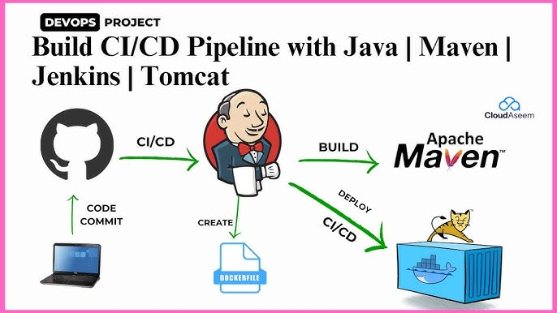
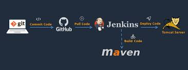
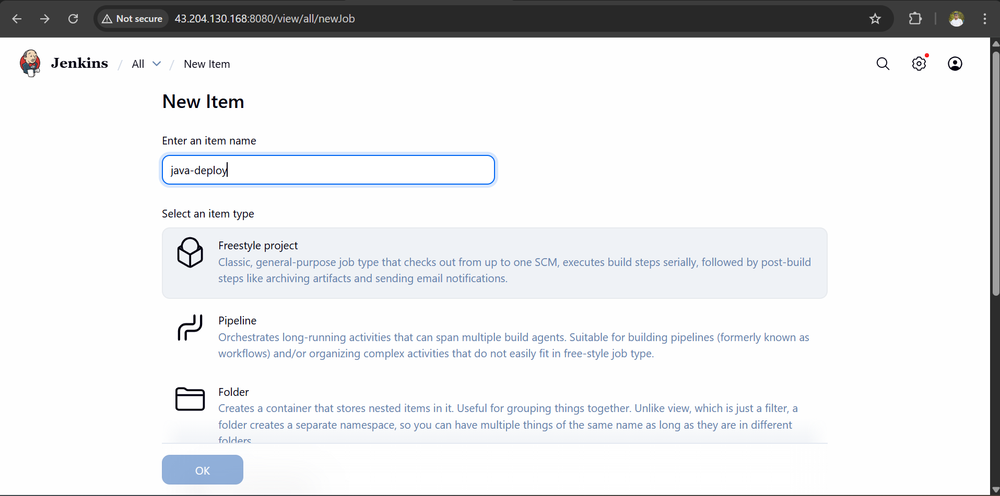
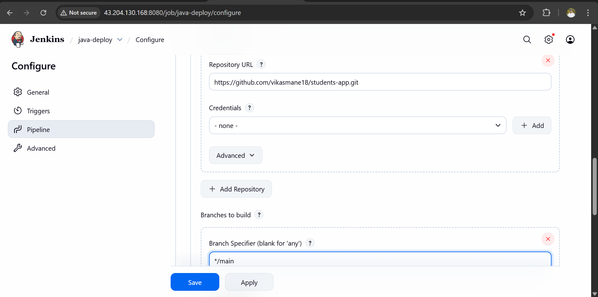
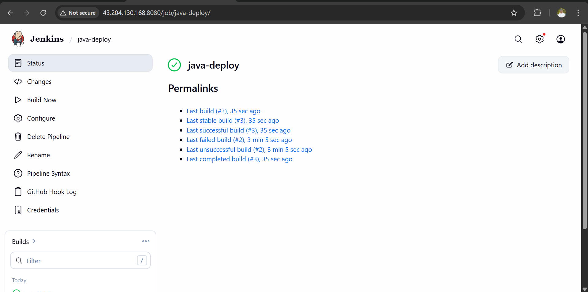
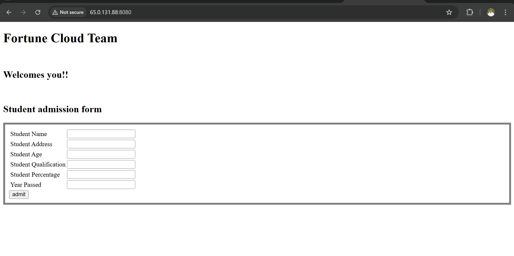

#  Java Application Deployment using Jenkins

##  Project Overview
This project demonstrates the **Continuous Integration and Continuous Deployment (CI/CD)** process of a **Java-based application** using **Jenkins**.  
The pipeline automates the steps from code checkout to deployment, ensuring smooth and repeatable deployments.

---

##  Key Objectives
- Automate build, test, and deployment of a Java project.  
- Use Jenkins pipelines for end-to-end CI/CD automation.  
- Deploy the Java application on a Linux/Ubuntu server or Docker container.  
- Maintain continuous integration with GitHub for version control.


---

##  Tools & Technologies Used
| Tool | Purpose |
|------|----------|
| **Java (JDK 17+)** | Core programming language |
| **Maven / Gradle** | Build and dependency management |
| **Git & GitHub** | Source code management |
| **Jenkins** | CI/CD automation tool |
| **Tomcat / Docker** | Application deployment platform |
| **Linux / Ubuntu** | Hosting environment |

---

##  CI/CD Pipeline Stages
##  1. Install Required Tools
  
   - The pipeline automatically pulls the latest source code from the **GitHub repository** using Jenkins.  
   - This ensures that every new commit triggers a fresh build and deployment.
   
   
   


###  On Ubuntu Server
```bash
# Update system
sudo apt update -y

# Install Java
sudo apt install openjdk-17-jdk -y
java -version

# Install Maven
sudo apt install maven -y
mvn -version

# Install Git
sudo apt install git -y

# Install Tomcat 9
sudo apt install tomcat9 tomcat9-admin -y
sudo systemctl enable tomcat9
sudo systemctl start tomcat9

# Install Jenkins
sudo apt install openjdk-17-jdk -y
wget -q -O - https://pkg.jenkins.io/debian/jenkins.io.key | sudo apt-key add -
sudo sh -c 'echo deb https://pkg.jenkins.io/debian-stable binary/ > /etc/apt/sources.list.d/jenkins.list'
sudo apt update -y
sudo apt install jenkins -y
sudo systemctl enable jenkins
sudo systemctl start jenkins
````


## 3. **Deploy**  
   - The generated `.war` file is copied to the **Tomcat server’s webapps directory**.  
   - Tomcat is restarted or auto-deploys the new version.  
   - Command example:  
     ```bash
     sudo systemctl stop tomcat9
     sudo cp target/*.war /var/lib/tomcat9/webapps/
     sudo systemctl start tomcat9
     ```


## 4. **Monitor**  
   - After deployment, verify that the application is running successfully on the server.  
   - Check Tomcat logs and application status:  
     ```bash
     sudo tail -f /var/log/tomcat9/catalina.out
     ```  
     
   

---
## 🏁 Conclusion

This project successfully demonstrates the complete **CI/CD lifecycle** for a Java-based application using **Jenkins**.  
By integrating tools like **GitHub**, **Maven**, **Tomcat**, and **Jenkins**, the deployment process becomes fully automated — from source code checkout to production deployment.

Through this setup:
- Developers can deliver new features faster and with higher reliability.  
- Manual errors are eliminated with automated testing and builds.  
- Continuous monitoring ensures smooth and stable application performance.  

Overall, this project showcases how **DevOps practices** streamline Java application delivery using modern automation tools.
---